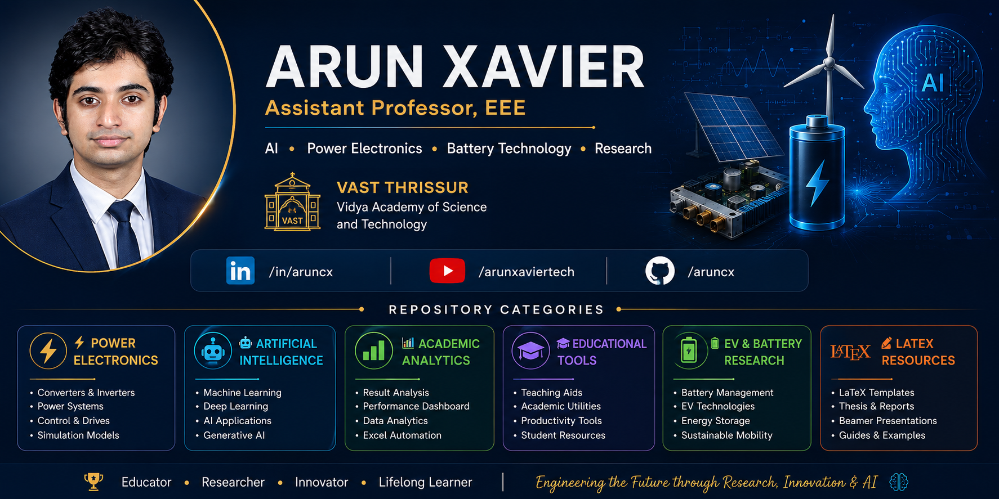

<p align="center">
  
</p>

# Hi 👋 I'm Arun Xavier

### ⚡ Assistant Professor | Researcher | AI Enthusiast | Content Creator

<p align="center">
  
</p>

---

## 🚀 About Me

🎓 Assistant Professor in Electrical & Electronics Engineering

🏛️ Vidya Academy of Science & Technology (VAST), Thrissur

📚 11+ Years of Teaching Experience

🔬 Active Researcher in

* Power Electronics
* Renewable Energy Systems
* Battery Technologies
* Electric Vehicles
* Artificial Intelligence Applications
* Engineering Education Technologies

🎥 Creator of **Arun Xavier Tech**

Sharing engineering tutorials, LaTeX training, AI tools, KTU learning resources, and technology content.

---

## 🌟 Professional Highlights

* Published Research Articles in International Journals
* Google Scholar Indexed Researcher
* FDP Resource Person
* LaTeX Trainer
* Academic Analytics Developer
* Student Project Mentor
* AI Advocate in Engineering Education

---

## 🔬 Research Interests

```text
Power Electronics
Battery Management Systems
Electric Vehicles
Artificial Intelligence
Machine Learning
Renewable Energy Systems
Smart Grid Technologies
IoT Applications
Engineering Education
Academic Analytics
```

---

## 💻 Technical Skills

### Programming

* Python
* MATLAB
* C Programming

### Engineering Software

* MATLAB / Simulink
* LTspice
* PSCAD
* ETAP
* Arduino IDE
* Proteus
* AutoCAD

### Research & Documentation

* LaTeX
* Overleaf
* Research Writing
* Technical Documentation

### AI & Data

* ChatGPT
* Google Gemini
* Prompt Engineering
* Educational AI
* Data Analytics

---

## 📈 GitHub Analytics

<p align="center">


</p>

<p align="center">

</p>

---

## 🎥 Arun Xavier Tech

Engineering education meets technology.

### Featured Topics

* Artificial Intelligence
* ChatGPT & Gemini
* LaTeX Tutorials
* KTU Engineering Subjects
* MATLAB Simulations
* Power Electronics
* Educational Technology
* Productivity Tools

📺 YouTube:
https://www.youtube.com/@arunxaviertech

---

## 📚 Research Profile

### Google Scholar

Research publications focusing on:

* Power Electronics
* Renewable Energy
* Engineering Applications
* Emerging Technologies

Scholar Profile:
https://scholar.google.com/citations?user=hjOMPOwAAAAJ

---

## 🚀 Featured Projects

### 📊 KTU Result Analytics Platform

A comprehensive academic analytics system providing:

* SGPA Analysis
* CGPA Tracking
* Student Performance Reports
* Department Analytics
* Excel Automation

---

### 🤖 AI for Education

Tools and experiments integrating Generative AI into:

* Teaching
* Assessment
* Academic Administration
* Research Assistance

---

### ⚡ Power Electronics Simulations

Simulation models and educational resources related to:

* Converters
* Inverters
* Motor Drives
* Renewable Energy Systems

---

### 🔋 Battery & EV Research

Projects related to:

* Battery Monitoring
* EV Technologies
* Energy Storage
* Sustainable Mobility

---

## 🌱 Currently Learning

* Advanced AI Systems
* Agentic AI
* Battery Analytics
* Explainable AI
* AI for Engineering Research

---

## 🌐 Connect With Me

LinkedIn:
https://www.linkedin.com/in/aruncx/

Google Scholar:
https://scholar.google.com/citations?user=hjOMPOwAAAAJ

YouTube:
https://www.youtube.com/@arunxaviertech

GitHub:
https://github.com/aruncx

---

### 💡 Engineering the Future through Research, Artificial Intelligence, and Innovation
